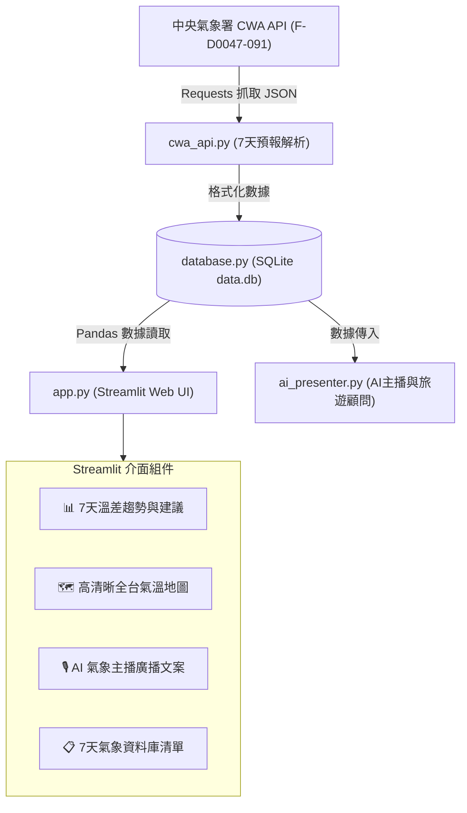

# 🌤️ Taiwan Weather Forecast Pro 7 天氣象互動儀表板
> **AI 創新微課程：從氣象資料到互動式天氣預報應用**  
> **Code Smarter, Build a Better Tomorrow!**  
> **講師：煥哥** | *用程式探索天氣 · 用資料看見台灣 · 用 AI 實現更多可能*

---

## 📌 專案簡介 (Project Overview)

本專案為 **AIOT-L3-CWA 微課程** 的完整實作成果。從中央氣象署 (CWA) Open Data API 抓取 **全台 22 縣市未來 7 天一週天氣預報數據**，透過 SQLite 資料庫持久化與去重管理，最後使用 Streamlit、Folium 高清彩圖與 AI 氣象主播生成器，打造全功能、高互動性、新聞級的台灣天氣視覺化儀表板。

---

## 🛠️ 技術棧與架構圖 (Tech Stack & Architecture)



* **數據來源**：`CWA Open Data API (F-D0047-091)` 7 天一週天氣預報
* **語言與庫**：`Python 3.14` × `Requests` × `Pandas`
* **資料庫**：`SQLite3` (支援 `data.db` 結構化儲存與 UNIQUE 自動去重)
* **Web UI 與地圖**：`Streamlit` × `Folium` (支援 `OpenStreetMap` 高清底圖與 `DivIcon` 免點擊浮動文字標籤)
* **AI 應用**：`ai_presenter` (新聞級氣象廣播文案生成 + 0~100 戶外旅遊適合度指數)
* **自動化測試**：`test_suite.py` (包含 API、DB、AI 生成與地圖座標 4 大自動化單元測試)

---

## 🗺️ 24 單元完整學習地圖對照 (24 Modules Roadmap)

| 單元 | 主題 | 實現模組 / 說明 |
|---|---|---|
| **01~03** | 課程介紹與 CWA 平台註冊 | 取得 CWA API Key，確立專案架構 |
| **04~06** | API 資料抓取與 JSON 解析 | [cwa_api.py](file:///d:/L3%20CWA/cwa_api.py) 提取全台 MinT, MaxT, Wx, PoP |
| **07~10** | SQLite 資料庫設計與 SQL 驗證 | [database.py](file:///d:/L3%20CWA/database.py) 建立 `data.db` 與 `TemperatureForecasts` 表 |
| **11~16** | Streamlit 入門與數據折線圖 | [app.py](file:///d:/L3%20CWA/app.py) 下拉選單、即時數據表與 MinT/MaxT 趨勢圖 |
| **17~19** | Folium 台灣地圖與氣溫熱力卡 | [app.py](file:///d:/L3%20CWA/app.py) 整合 OpenStreetMap 彩圖與 DivIcon 浮動氣溫卡 |
| **20** | 程式碼品質與錯誤處理 | 全模組 Try-Except、InsecureRequestWarning 處理與模組化架構 |
| **21** | Git 版本管理與 GitHub 推送 | 自動同步推送到 GitHub 儲存庫 `ping29065147/AIOT-L3-CWA` |
| **22** | 延伸應用 (AI主播與旅遊顧問) | [ai_presenter.py](file:///d:/L3%20CWA/ai_presenter.py) 氣象廣播稿、旅遊適合度評估與 CSV 導出 |
| **23~24** | 測試與終極部署完結 | [test_suite.py](file:///d:/L3%20CWA/test_suite.py) 全套自動化單元測試與完結部署 |

---

## 💻 本地端快速啟動指南 (Quick Start)

### 1. 複製儲存庫
```powershell
git clone git@github.com:ping29065147/AIOT-L3-CWA.git
cd AIOT-L3-CWA
```

### 2. 安裝依賴套件
```powershell
pip install -r requirements.txt
```

### 3. 執行自動化測試腳本 (Verification)
```powershell
python test_suite.py
```

### 4. 啟動 Web 儀表板應用程式
```powershell
python -m streamlit run app.py
```
*開啟瀏覽器連至 `http://localhost:8501` 即可開始體驗！*

---

## 💡 煥哥的名言 (Quotes)

> 💬 **「與你一起用 AI 寫程式，探索更大的世界！」**  
> 💬 **「技術可以解決問題，但更重要的是，用技術創造更好的未來！」**  
>  
> — **煥哥**  
> *Learn Today, Build Tomorrow. AI for Learning, AI for a Better Taiwan.*
