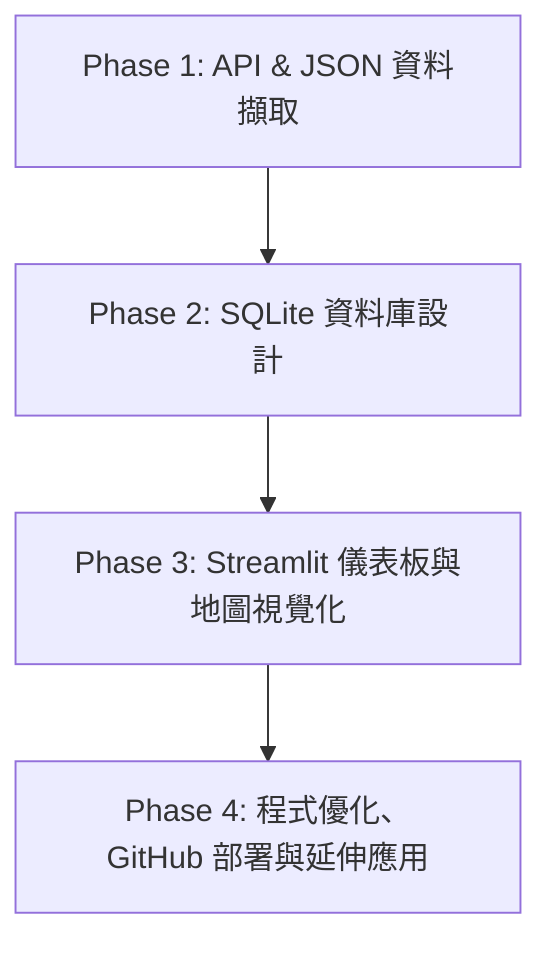

# 🌤️ AI 創新微課程：Taiwan Weather Forecast
> **從氣象資料到互動式天氣預報應用**  
> **Code Smarter, Build a Better Tomorrow!**  
> **講師：煥哥** | *用程式探索天氣 · 用資料看見台灣 · 用 AI 實現更多可能*

---

## 📌 課程概述與核心技術棧 (Course Overview & Tech Stack)

本課程引導學員從中央氣象署 (CWA) Open Data API 抓取即時天氣資料，經過 JSON 解析、SQLite 資料庫儲存，最後使用 Streamlit 與 Folium 建立互動式台灣天氣預報 Web 應用程式，並部署至 GitHub。

### 🛠️ 核心技術棧 (Tech Stack)
* **API 擷取**：`CWA Open Data API` × `Python Requests`
* **資料解析**：`JSON` × `Pandas`
* **資料庫管理**：`SQLite3` × `SQL`
* **Web 互動與視覺化**：`Streamlit` × `Folium` (互動式地圖)
* **版本控制與部署**：`Git` × `GitHub`

---

## 🗺️ 24 單元完整學習地圖 (24 Modules Learning Roadmap)



### 🔹 第一階段：資料擷取與解析 (單元 01 ~ 06)

| 單元 | 主題 | 核心內容與實作重點 |
|---|---|---|
| **01** | **課程介紹** | • AI × 資料 × 天氣 × 實作<br>• 課程目標、學習地圖與專案成果展示 |
| **02** | **台灣的天氣與生活** | • 氣象對日常生活與決策的重要性<br>• 資料驅動決策與智慧應用案例 |
| **03** | **中央氣象署 CWA** | • CWA Open Data 平台介紹<br>• 註冊帳號、取得 API Key 並選擇資料集 |
| **04** | **API 資料取得** | • 使用 Python `requests` 庫取得 JSON 資料<br>```python\nimport requests\nurl = 'https://...' \nheaders = {'Authorization': 'API_KEY'}\nresp = requests.get(url)\ndata = resp.json()\n``` |
| **05** | **JSON 資料結構解析** | • 定位氣溫資料 (MinT / MaxT)<br>```json\n{\n  "locations": [{\n    "locationName": "中部地區",\n    "weatherElement": [\n      {"elementName": "MinT"},\n      {"elementName": "MaxT"}\n    ]\n  }]\n}\n``` |
| **06** | **提取最高與最低氣溫** | • 解析 JSON 資料結構<br>• 提取每日 MinT (最低溫) 與 MaxT (最高溫)<br>• 轉換為結構化資料陣列 |

---

### 🔹 第二階段：資料整理與 SQLite 資料庫設計 (單元 07 ~ 10)

| 單元 | 主題 | 核心內容與實作重點 |
|---|---|---|
| **07** | **資料整理與預覽** | • 使用 Pandas 觀察與清洗資料<br>• 結構範例：<br>`regionName` \| `dataDate` \| `minT` \| `maxT`<br>北部地區 \| 2026-04-14 \| 18 \| 26<br>中部地區 \| 2026-04-14 \| 20 \| 30<br>南部地區 \| 2026-04-14 \| 22 \| 31 |
| **08** | **建立 SQLite 資料庫** | • 建立本地資料庫檔案 `data.db`<br>• 創建資料表並實現氣溫資料批量插入 |
| **09** | **資料庫設計 (Schema)** | • 定義 `TemperatureForecasts` 資料表欄位結構：<br>```sql\nCREATE TABLE TemperatureForecasts (\n    id INTEGER PRIMARY KEY AUTOINCREMENT,\n    regionName TEXT,\n    dataDate TEXT,\n    minT REAL,\n    maxT REAL\n);\n``` |
| **10** | **查詢資料驗證** | • 使用 SQL 語句檢查與驗證資料正確性<br>```sql\nSELECT DISTINCT regionName FROM TemperatureForecasts;\nSELECT * FROM TemperatureForecasts WHERE regionName = '中部地區';\n``` |

---

### 🔹 第三階段：Streamlit 互動 Web App 與圖表視覺化 (單元 11 ~ 20)

| 單元 | 主題 | 核心內容與實作重點 |
|---|---|---|
| **11** | **Streamlit 入門** | • 安裝 Streamlit 環境 (`pip install streamlit`)<br>• 基本 Web App 結構與 Hello World 實作 |
| **12** | **從資料庫讀取資料** | • 連接 `data.db` 並使用 SQL 查詢載入 Pandas DataFrame<br>```python\nimport sqlite3, pandas as pd\nconn = sqlite3.connect('data.db')\ndf = pd.read_sql_query("SELECT * FROM TemperatureForecasts", conn)\n``` |
| **13** | **下拉選單選擇地區** | • 建立互動式 SelectBox 組件<br>• 選項：北部地區、南部地區、東北部地區、東北部地區、東南部地區 |
| **14** | **繪製折線圖** | • 繪製一週最高溫 (MaxT) 與最低溫 (MinT) 變化趨勢圖 (04/14 ~ 04/20) |
| **15** | **顯示資料表格** | • 清晰呈現選定地區的一週氣溫數據表格 (Date, MinT, MaxT) |
| **16** | **整合 Web App 介面** | • 打造 Taiwan Weather Forecast 儀表板主介面，整合選單、圖表與數據 |
| **17** | **進階：台灣地圖視覺化** | • 使用 `Folium` + `Streamlit` 結合地圖元件<br>• 依平均氣溫填色：`<20℃` (藍)、`20-25℃` (綠)、`25-30℃` (橘)、`>30℃` (紅) |
| **18** | **選擇日期顯示地圖** | • 提供日期選擇器 (Date Picker)，切換顯示全台各地區特訂日期的預報數據 |
| **19** | **完整成果展示** | • 完成 Taiwan Weather Dashboard，將地圖、統計表與趨勢圖整合為單一應用 |
| **20** | **程式碼品質與優化** | • 模組化程式碼結構、錯誤處理 (Try-Except) 機制<br>• 避免重複執行時重複插入資料、加入詳細註解 |

---

### 🔹 第四階段：專案部署、延伸與未來展望 (單元 21 ~ 24)

| 單元 | 主題 | 核心內容與實作重點 |
|---|---|---|
| **21** | **專案上傳至 GitHub** | • Git 版本管理、建立 GitHub Repository<br>• 遠端庫連結 (Remote Origin) 與 Commit & Push |
| **22** | **延伸應用與想法** | • **天氣提醒 Line Bot**：自動發送降雨/高溫警報<br>• **旅遊行程建議**：結合氣象資料給予出遊建議<br>• **農業 / 防災應用**：寒害與暴雨預警<br>• **結合 AI 做分析**：使用 LLM 進行氣候趨勢判讀與自動化播報 |
| **23** | **回顧與重點整理** | • 掌握 API 擷取、JSON 解析、SQLite 資料庫、Streamlit Web App 與 AI × Coding 實作全流程 |
| **24** | **下一步：繼續探索** | • **AI × Data × Real World**：探索更多政府 Open Data API<br>• 活用 AI 輔助開發，打造屬於自己的數據導向作品！ |

---

## 💡 煥哥的名言與學習理念 (Quotes & Philosophy)

> 💬 **「與你一起用 AI 寫程式，探索更大的世界！」**  
> 💬 **「技術可以解決問題，但更重要的是，用技術創造更好的未來！」**  
>  
> — **煥哥**  
> *Learn Today, Build Tomorrow. AI for Learning, AI for a Better Taiwan.*

---

## 🚀 如何在本地端執行本專案 (How to Run Locally)

### 1. 複製儲存庫 (Clone Repository)
```bash
git clone git@github.com:ping29065147/AIOT-L3-CWA.git
cd AIOT-L3-CWA
```

### 2. 安裝必要套件 (Install Dependencies)
```bash
pip install requests pandas streamlit folium streamlit-folium
```

### 3. 執行 Streamlit Web App
```bash
streamlit run app.py
```
